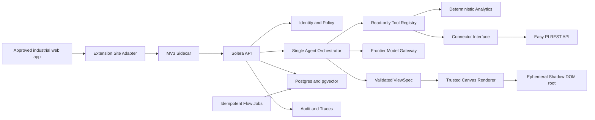
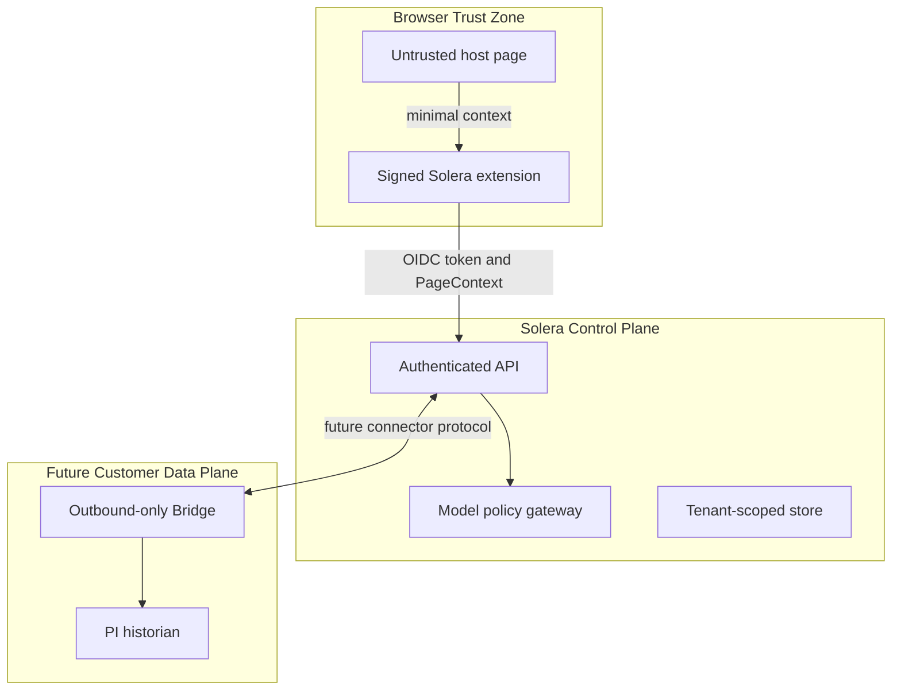

# Solera v0.1 System Architecture

## Architectural stance

v0.1 is a modular monolith plus a browser extension, not a collection of
microservices. Boundaries are explicit in contracts so components can be
separated only when deployment or scaling evidence requires it.



## Runtime components

### Browser extension

- Chrome/Edge Manifest V3 with a native side panel.
- A service worker owns authentication/session and extension message routing.
- Content scripts run only on tenant-approved domains.
- Site Adapters emit minimal `PageContext`; they do not decide authorization.
- PI Vision render output supplies context candidates only.
- Canvas mounts one isolated root and returns a cleanup handle that removes all
  Solera-owned resources.

### Solera API

- FastAPI application organized into identity, policy, sessions, agent, tools,
  connectors, analytics, Canvas, knowledge, audit, and operations modules.
- Streaming uses newline-delimited server events over an authenticated `fetch`
  response; the transport can later be adapted without changing Agent events.
- The model gateway is provider-neutral and receives only policy-approved data.
- The orchestrator is a bounded state machine. A tool can execute only after
  identity, tenant, capability, asset, range, and egress checks.

### Data and Flow

- Postgres is the initial system of record.
- `pgvector` is optional for v0.1 document retrieval; relational edges represent
  asset and knowledge relations.
- Time-series data is queried on demand. Solera stores Evidence and controlled
  aggregates, not an unrestricted copy of the PI archive.
- Flow jobs are idempotent and versioned. Local development runs them in-process
  or by CLI; production scheduling remains an adapter.

### Proposed v0.2 Data Flywheel

The post-Pilot direction adds a governed data and knowledge loop:

```text
PI / Easy PI / MES / ERP / documents
  → Data Services
  → quality + lineage + bounded aggregates
  → Site / Asset / Tag graph
  → Open Wiki + tenant-filtered Vector retrieval
  → Skills, Canvas, reports, and feedback
  → replayable evaluation and next-cycle improvements
```

This is a proposal, not a v0.1 implementation claim. Solera should retain
Evidence and controlled aggregates rather than blindly copying an entire
historian. Monthly windows and long-term trends require explicit retention,
cost, downsampling, timezone, and tenant policies. Vector retrieval provides
recall; the graph provides typed relationships; Data Services remains the
numerical source of truth.

The Site/Asset model is also the foundation for future 2.5D Canvas and 3D
Scene experiences. Spatial rendering must consume validated identity,
time-series, and Evidence contracts rather than arbitrary model-generated
scene code.

## Trust boundaries



During public-test development the Easy PI connector runs as a library inside
the API process. Its interface already separates credentials, capabilities,
request limits, and transport. A deployed Bridge is introduced only when a
real private historian requires it.

## Source-of-truth rules

- Host URL/DOM/screenshot: context hint.
- Easy PI or another approved industrial API: raw numerical source.
- Analytics library: calculated numerical source.
- Versioned documents: knowledge source.
- Model: planning and explanation, never numerical authority.
- Evidence: binding record connecting a conclusion to source, query, method,
  quality, and versions.

## Repository boundaries

```text
apps/sidecar-extension
  src/adapters       page-specific context extraction
  src/background     identity, policy cache, message routing
  src/sidepanel      Chat, Context, Insights, Pins
  src/content        overlay lifecycle

apps/solera-api
  solera_api/api
  solera_api/agent
  solera_api/analytics
  solera_api/auth
  solera_api/policy
  solera_api/storage

packages/contracts
  schema             JSON Schema source of truth
  generated          generated language types
  fixtures           compatibility fixtures

packages/canvas-renderer
  src/widgets
  src/validation
  src/lifecycle

connectors/easy-pi
  easy_pi             connector implementation
  tests               recorded/redacted contract fixtures

flows
  solera_flows        aggregate, knowledge, and eval jobs
```

Imports point inward through contracts. The browser never imports server
secrets or connector code. Connector implementations do not import Agent or
Canvas code. Analytics functions are pure and independently testable.
